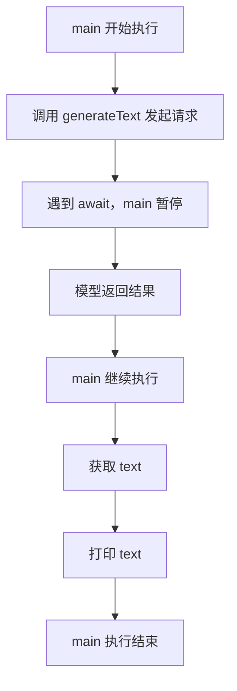
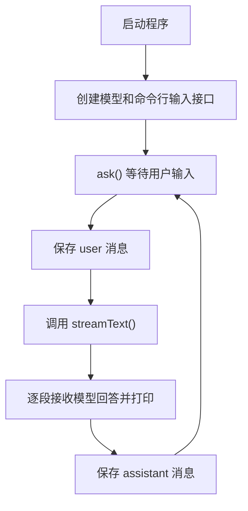

# 一.相关包解释

```bash
pnpm add ai @ai-sdk/openai dotenv

1 ai
  Vercel 的 AI SDK。把不同模型的差异屏蔽了——不管背后是 Qwen、Claude 还是 GPT，调用代码完全一致。换模型改一行配置。
2 @ai-sdk/openai
  OpenAI 兼容协议的适配器。Qwen 的 DashScope API 支持 OpenAI 兼容格式，所以用这个包就能直接调。AI SDK 采用的是 Provider 模式——核心包 ai 定义统一接口，每个模型厂商出一个 Provider 来适配自己的 API。
3 dotenv
  负责从 .env 文件加载环境变量，API Key 等敏感信息不会写死在代码里。
```

# 二.第一次调模型

```typescript
import "dotenv/config"; // 1 自动读取项目根目录下的 .env 文件. 2 使 process.env.DASHSCOPE_API_KEY 可用。
import { generateText } from "ai"; //generateText 是 AI SDK 的文本生成接口
import { createOpenAI } from "@ai-sdk/openai";
import { createMockModel } from "./mock-model";

// createOpenAI 创建一个 OpenAI 兼容的模型提供商。
const qwen = createOpenAI({
  baseURL: "https://dashscope.aliyuncs.com/compatible-mode/v1", // 指向 DashScope 的兼容接口
  apiKey: process.env.DASHSCOPE_API_KEY, // apiKey从.env环境变量中读取
});

// 选择模型：配置了就调用qwen-plus-latest;没配置就走本地mock模型
const model = process.env.DASHSCOPE_API_KEY
  ? qwen.chat("qwen-plus-latest")
  : createMockModel();

//async：表示 main 是一个异步函数，可以使用 await。
async function main() {
  // const {text} =  await generateText(...).
  // text：是从返回值中取出生成的text
  // await：等待请求完成，拿到真正的返回结果后，再继续执行下一行。
  // generateText(....)：会发起网络请求，返回一个 Promise，结果不会立刻得到。

  // 1. 发起请求,请求完成后拿到text
  const { text } = await generateText({
    model,
    prompt: "用一句话介绍你自己",
  });

  //2. 打印await返回结果里面的text
  console.log(text);
}

main(); //调用异步函数main
```

## 1 核心设计

```bash
1 model 变量的类型是 AI SDK 的统一接口。
  不管背后是 mock 还是 Qwen，generateText 都不需要知道具体实现。
  这就是 Provider 模式的价值：调用方和实现方解耦，切换模型不改业务代码。
  注意：我们用的是 createOpenAI 而不是某个 Qwen 专用的包。
  通过 qwen.chat() 来创建模型实例，确保走标准的 Chat Completions 协议。
  Qwen 的 DashScope API 兼容 OpenAI 协议格式，只需要将 baseURL 指向 DashScope 的地址即可。
  这也是 OpenAI 兼容协议的优势：同一套代码，换个地址就能对接不同的模型。

  2 generateText 是同步返回的。
  等模型把完整回复生成完毕后一次性返回。
  这对后台任务没问题，但在聊天场景下体验很差：如果回复有 500 字，用户需要等待数秒，然后突然出现一大段文字。

```

## 2 main()的异步执行流程



# 三.从"等半天"到边想边说

```typescript
import "dotenv/config";
import { streamText } from "ai";
import { createOpenAI } from "@ai-sdk/openai";
import { createMockModel } from "./mock-model";

const qwen = createOpenAI({
  baseURL: "https://dashscope.aliyuncs.com/compatible-mode/v1",
  apiKey: process.env.DASHSCOPE_API_KEY,
});

const model = process.env.DASHSCOPE_API_KEY
  ? qwen.chat("qwen-plus-latest")
  : createMockModel();

async function main() {
  const result = streamText({
    model,
    prompt: "用一句话介绍你自己",
  });

  for await (const chunk of result.textStream) {
    // process.stdout.write 和 console.log 的区别在于不会自动加换行。
    // 字符连续输出，呈现“打字”的效果
    process.stdout.write(chunk);
  }
  console.log(); // 换行
}

main();
```

## 1 关键解释

```bash
把 generateText 换成 streamText
运行一下,会看到文字逐个出现,就像打字机效果.
背后机制：
调用 streamText 时，SDK 发出一个带 stream: true 的请求。模型不再等全部生成完，而是每生成几个 token 就通过 SSE（Server-Sent Events）推送一个事件。SDK 将这些 SSE 事件解析成异步迭代器 textStream——每次 for await 就拿到一小段新文字。

```

# 四.让它变成对话

```typescript
import "dotenv/config";
import { streamText, type ModelMessage } from "ai";
import { createOpenAI } from "@ai-sdk/openai";
import { createMockModel } from "./mock-model";
import { createInterface } from "node:readline";// readline：读取用户输入

const qwen = createOpenAI({
  baseURL: "https://dashscope.aliyuncs.com/compatible-mode/v1",
  apiKey: process.env.DASHSCOPE_API_KEY,
});

const model = process.env.DASHSCOPE_API_KEY
  ? qwen.chat("qwen-plus-latest")
  : createMockModel();

//rl：创建好的命令行接口对象
const rl = createInterface({
  input: process.stdin, // 接收键盘输入
  output: process.stdout, // 向终端输出内容
});

//messages: 数组就是对话历史，用于保存对话历史。用户说一句就push一条,AI回复一句push一条
//ModelMessage：AI SDK定义的消息类型，每条包含（user或assistant和content）
const messages: ModelMessage[] = []; 


function ask() {
  //等待用户输入.用户输入后,执行后面的异步回调函数
  rl.question("\nYou: ", async (input) => {

    const trimmed = input.trim();//去除收尾空格
    
    //如果首位空格为空或 exit，程序退出
    if (!trimmed || trimmed === "exit") {
      console.log("Bye!");
      rl.close(); //关闭命令行输入接口，不再等待用户输入。
      return;
    }

    messages.push({ role: "user", content: trimmed });//用户消息保存到历史记录


    //调用模型生成回答。streamText 不会一次性返回完整文本，而是返回一个可以逐步读取的文本流。
    const result = streamText({
      model,
      messages,
    });

    process.stdout.write("Assistant: ");
    let fullResponse = "";

    //result.textStream：模型返回到文本流
    //for await...of：异步逐段读取
    for await (const chunk of result.textStream) {
      process.stdout.write(chunk); //立即显示给用户
      fullResponse += chunk;       //   fullResponse=fullResponse+fuchunk;  同时拼接完整回答
    }
    console.log(); // 换行

    messages.push({ role: "assistant", content: fullResponse }); //模型回答完成后,把完整回答保存到历史记录

    ask();//递归调用自己.形成循环：等待输入 -> 发给模型 -> 流式输出 -> 等待输入 ....这就是Agent Loop的雏形，还没有工具调用的能力
  });
}

console.log('Super Agent v0.1 (type "exit" to quit)\n');
ask(); //调用ask函数
```

## 整体流程


## 定义角色
```typescript
const result = streamText({
  model,
  system: `你是 Super Agent，一个专注于软件开发的 AI 助手。
你说话简洁直接，喜欢用代码示例来解释问题。
如果用户的问题不够清晰，你会反问而不是瞎猜。`,
  messages,
});
```
```bash
system prompt：可以定义Agent的行为风格.不只是"一段提示词”,更像是Agent的行为控制系统————决定了在什么场景下做什么、如何组织回复、如何使用工具。

```

## 三个核心要素

1. **模型调用**：`streamText` + `model`。将消息发送给模型，获取流式响应。无论 model 背后是 mock 还是真实 API，调用方式完全一致——这就是 Provider 模式的价值。
2. **消息管理**：`messages: ModelMessage[]`。每轮对话向数组 push 一条 user 和一条 assistant 消息，下一轮将整个数组传给模型。最基础的上下文管理——全量传递，不做压缩。
3. **交互循环**：`ask()` 递归调用自身，形成 readline → streamText → push → readline 的循环。