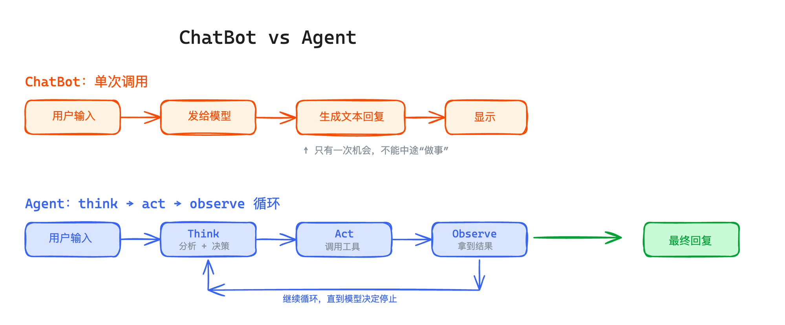

# 一.Agent Loop的核心思想
**模型不止跑一次，而是跑一个循环——想、做、看结果，然后决定是继续做还是给出最终回答。**

## ChatBot 和 Agent的区别


```bash
You: 北京和上海今天哪个更热？

--- Step 1 ---
  [调用: get_weather({"city":"北京"})]
  [结果: "晴，15-25°C，东南风 2 级"]
  [调用: get_weather({"city":"上海"})]
  [结果: "多云，18-22°C，西南风 3 级"]
  → 模型还在工作，继续下一步...

--- Step 2 ---
Assistant: 对比两个城市今天的天气：
- 北京：15-25°C
- 上海：18-22°C

北京的最高温更高（25°C vs 22°C），所以今天北京更热一些。
```
```text
ChatBot 一步到位、直接编答案。
Agent 会规划——"我需要什么数据 → 去获取 → 拿到之后再分析"。模型自己决定调什么工具、调几次、什么时候停。
```

## mini Agent Loop
```bash
while (true) {
  const response = await llm.chat(messages)  // 想：让模型决定下一步

  if (response.toolCalls.length === 0) {
    break  // 模型认为任务完成了，没有工具要调
  }

  for (const toolCall of response.toolCalls) {
    const result = await executeTool(toolCall)  // 做：执行工具
    messages.push(result)                        // 看：把结果加入上下文
  }
}

```
**think -> act -> observe**
1. **Think**：模型分析当前情况，决定下一步做什么
2. **Act**：如果需要，调用工具执行操作
3. **Observe**：拿到工具返回的结果
4. 然后回到Think,直到模型认为可以给出最终回答

# 二.定义一个工具
一个工具由三样东西组成：

- **description**：告诉模型这个工具是干什么的（模型靠这个判断什么时候该调它）
- **inputSchema**：工具接受什么参数（用 JSON Schema 定义）
- **execute**：实际执行函数

```typescript
import { jsonSchema } from 'ai';

//天气工具(mock版)
export const weatherTool = {
  description: '查询指定城市的天气信息', //不是给人看的，给模型看的。描写的越准确，模型调用的时机就越精确。
  inputSchema: jsonSchema({
    type: 'object',
    properties: {
      city: { type: 'string', description: '城市名称，如"北京"、"上海"' },
    },
    required: ['city'],
    additionalProperties: false,
  }),// 用jsonSchema()定义工具的参数结构——本质是一段JSON Schema。AI SDK把它跟描述一起塞进请求发给模型
  execute: async ({ city }: { city: string }) => {
    // 先用假数据，后面课程会接真实 API
    const mockWeather: Record<string, string> = {
      '北京': '晴，15-25°C，东南风 2 级',
      '上海': '多云，18-22°C，西南风 3 级',
      '深圳': '阵雨，22-28°C，南风 2 级',
    };
    return mockWeather[city] || `${city}：暂无数据`;
  },//普通的异步函数。模型决定调用工具时，SDK 会自动用模型返回的参数调用 execute，然后把返回值序列化成字符串，作为 tool-result 消息塞回对话历史里。
};
```

# 三.Agent Loop（自动循环）
```typescript
// Vercel AI SDK 提供了一个很方便的能力——自动多步执行。
// 当模型返回工具调用时，SDK 会自动执行工具、把结果喂回模型、让模型继续生成，直到模型不再调用工具为止。
import { streamText, stepCountIs } from 'ai';


const result = streamText({
  model,
  tools,
  messages,
  stopWhen: stepCountIs(5), // 最多跑 5 步
});
```
## 自动循环把循环藏起来了，可定制性差
```bash
无法在步骤之间插入自己的逻辑。打日志、追踪token、检测死循环、中断执行....都做不了，循环被SDK藏起来了。 
生产级Agent几乎都自己控制循环。比如Claude Code、OpenClaw、OpenCode等等
```

# 四.Agent Loop（手动循环）

```typescript
/*
streamText：以流式方式调用模型
ModelMessage：TypeScript 类型，用来描述消息格式。
常见的消息有：
1 SystemModelMessage(系统模型消息)
2 UserModelMessage(用户模型消息)
3 AssistantModelMessage(助手模型消息)
4 ToolModelMessage(工具模型消息)
*/
import { streamText, type ModelMessage } from 'ai';

const MAX_STEPS = 10;//最多执行10步,防止模型无限调用工具

//定义并导出一个异步函数agentLoop
export async function agentLoop(
  model: any,                 //传入模型对象，例如通义千问、OpenAI 模型等。
  tools: any,                 //传入工具集合，例如：{getWeather: {...}, searchWeb: {...}}，模型可以根据需要调用这些工具。
  messages: ModelMessage[],   //传入消息历史,类型是ModelMessage数组
  system: string,             //传入系统提示词,用来规定 Agent 的行为方式。
) {
  let step = 0;//记录当前执行步数，初始值为0

  //当前步数只要小于10，就继续执行循环
  while (step < MAX_STEPS) {
    step++; //每进入一轮，步数+1
    console.log(`\n--- Step ${step} ---`);

    //调用streamText，请求模型生成回答，返回的是一个流式结果对象，而不是最终文本
    const result = streamText({
      model,   //告诉SDK使用哪个模型
      system,  //传入系统提示词
      tools,   //传入模型可以调用的工具
      messages,//传入当前完整的消息历史
      // 不设 stopWhen，每次只跑一步
    });

    let hasToolCall = false; //记录本轮是否发生了工具调用，初始认为没有调用工具
    let fullText = '';       //拼接模型本轮输出的完整文本

    //异步遍历模型返回的完整事件流
    //for await：会等待事件逐个到达。
    //fullStream：包含了完整的事件流，每个事件都有type告诉发生了什么
    for await (const part of result.fullStream) {

      //根据当前事件的类型，执行不同逻辑。
      switch (part.type) {

        case 'text-delta': //表示模型返回了文本片段
          process.stdout.write(part.text); //立即把这段文本打印到终端，不自动换行。用户可以看到模型边生成边输出
          fullText += part.text; //把文本片段拼接起来，保存完整回答
          break; //结束当前分支

        case 'tool-call': //表示模型决定调用某个工具
          hasToolCall = true; //记录本轮发生了工具调用。
          ////打印工具名称和输入参数.eg:[调用: getWeather({"city":"北京"})]
          console.log(`  [调用: ${part.toolName}(${JSON.stringify(part.input)})]`); 
          break;

        case 'tool-result': //表示工具已经执行完成并返回结果
          //打印工具返回的数据.eg:[结果: {"temperature":28,"weather":"晴"}]
          console.log(`  [结果: ${JSON.stringify(part.output)}]`); 
          break;
      }//结束switch
    }//结束异步遍历，说明本轮流式响应已经完成。

  
    const stepMessages = await result.response; //拿到这一步的完整结果
    messages.push(...stepMessages.messages); //把本轮消息追加到历史记录中。下一轮模型就可以看到：用户问题、模型的工具调用、工具返回结果。

    // 退出条件：模型没有调用任何工具，说明它认为可以直接回复了
    if (!hasToolCall) {
      if (fullText) console.log(); //模型输出了文本，补一个换行，终端格式更整齐
      break; //退出while循环，Agent结束工作 
    }

    console.log('  → 模型还在工作，继续下一步...'); // 还有工具调用 → 继续循环，让模型看到工具结果后继续思考
  }

  //检查当前步数，是否达到了最大步数
  if (step >= MAX_STEPS) {
    console.log('\n[达到最大步数限制，强制停止]'); //达到上限时，打印停止提示。
  }
}

```


# 五.把手动循环接入对话

```typescript
import 'dotenv/config';
import { type ModelMessage } from 'ai';
import { createOpenAI } from '@ai-sdk/openai';
import { createMockModel } from './mock-model.js';
import { createInterface } from 'node:readline';
import { weatherTool, calculatorTool } from './tools.js';
import { agentLoop } from './agent-loop.js';

// ... model 定义同上一篇 ...

const tools = { get_weather: weatherTool, calculator: calculatorTool };
const messages: ModelMessage[] = [];
const rl = createInterface({ input: process.stdin, output: process.stdout });

const SYSTEM = `你是 Super Agent，一个有工具调用能力的 AI 助手。
需要查询信息时，主动使用工具，不要编造数据。
回答要简洁直接。`;

function ask() {
  rl.question('\nYou: ', async (input) => {
    const trimmed = input.trim();
    if (!trimmed || trimmed === 'exit') {
      console.log('Bye!');
      rl.close();
      return;
    }

    messages.push({ role: 'user', content: trimmed });

    await agentLoop(model, tools, messages, SYSTEM);

    ask();
  });
}

console.log('Super Agent v0.2 — Agent Loop (type "exit" to quit)\n');
ask();
```
## 1.完整执行流程
```text
程序启动
  ↓
显示 Super Agent v0.2
  ↓
ask() 等待用户输入
  ↓
用户输入问题
  ↓
将问题加入 messages
  ↓
await agentLoop(...)
  ↓
模型生成回答或调用工具
  ↓
工具返回结果
  ↓
Agent 继续执行，直到不再调用工具
  ↓
ask() 等待下一轮输入
```
## 2.外层循环：用户对话循环
由 ask() 和最后的 ask() 组成：
```text
ask();
```
## 3.内层循环：Agent工具循环
由 agentLoop() 内部的 while 循环组成：
```typescript
while (step < MAX_STEPS) {
  ...
}
```
它负责让模型反复执行：
```text
模型思考(think) → 调用工具(act) → 获取结果(observe) → 再次思考
```

## 4.整体的结构：
```text
用户对话循环
  └── Agent 工具循环
        └── 模型调用
        └── 工具执行
```