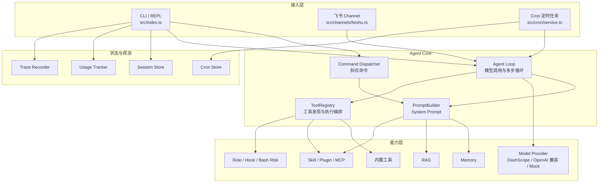

# AI Harness SuperAgent

一个基于 TypeScript、AI SDK 和工具调用循环构建的本地 CLI Super Agent。它能接飞书、有记忆、有 RAG、有工具系统、能装插件、能派子 Agent 的生产级 Super Agent，核心能力对齐 OpenClaw。

```bash
技术栈：
1 TypeScript + Node.js (ESM)
2 Vercel AI SDK
3 Hono (HTTP + WebSocket)
4 JSONL (Session 持久化)
```

## 能力概览

- **Agent Loop**：模型推理、工具调用、结果回传、Token 预算、重试与循环检测。
- **内置工具**：文件读写与编辑、目录浏览、本地 `glob`/`grep`、Shell、天气、计算器、网页搜索与抓取。
- **上下文管理**：Prompt Pipe、上下文视图、Token 估算、压缩和工具结果截断。
- **记忆系统**：本地记忆存储、检索、TTL 管理和 `/dream` 自动整理。
- **RAG 知识库**：导入 Markdown 文档，使用向量检索与 BM25 混合搜索。
- **Sub-Agent**：派生单个或并行子 Agent，并限制嵌套深度、并发数和执行步数。
- **扩展能力**：Skill 加载器、插件管理器和 MCP 工具注册。
- **自动化与接入**：Cron 定时任务、飞书长连接 Channel，以及 Channel Dashboard。
- **安全与可观测性**：owner/collaborator/guest 角色、Bash 风险控制、Hook 管线、Token 用量和 Trace 记录。

## 快速开始

### 环境要求

- Node.js 18+
- pnpm
- 一个 DashScope API Key（可选；不配置时使用 Mock Model）

### 安装

```bash
git clone <your-repository-url>
cd AI_Harness_SuperAgent_kkdw
pnpm install
```

### 初始化配置

推荐使用交互式向导：

```bash
pnpm run init
```

向导会生成：

- `super-agent.config.json`：模型、插件、Channel、Sub-Agent、安全策略等配置。
- `.env`：API Key 和飞书凭据等敏感信息。

也可以只设置环境变量后直接启动：

```bash
export DASHSCOPE_API_KEY="your-api-key"
pnpm start
```

启动后，在 `You:` 提示符输入问题；输入 `exit` 退出。

### 会话脚本

```bash
pnpm run continue
```

当前 CLI 的会话 ID 默认是 `default`，消息会持久化到 `.sessions/default.jsonl`。`continue` 脚本已预留，但当前启动入口尚未调用 `SessionStore.load()`，因此现阶段运行效果与 `pnpm start` 相同，不会自动把历史消息放回当前上下文。

## 配置

配置文件名固定为 `super-agent.config.json`。文件中的字符串支持 `${ENV_VAR}` 形式的环境变量替换。不存在配置文件时，程序会使用 Schema 默认值启动。

一个最小配置示例：

```json
{
  "model": {
    "provider": "dashscope",
    "name": "qwen-plus-latest",
    "baseURL": "https://dashscope.aliyuncs.com/compatible-mode/v1",
    "apiKey": "${DASHSCOPE_API_KEY}"
  },
  "agents": {
    "maxSpawnDepth": 1,
    "maxConcurrent": 3,
    "defaultTimeout": 60000
  },
  "channels": {
    "feishu": {
      "enabled": false,
      "appId": "${FEISHU_APP_ID}",
      "appSecret": "${FEISHU_APP_SECRET}",
      "port": 3000
    }
  }
}
```

主要配置项：

| 配置项 | 作用 | 默认值 |
| --- | --- | --- |
| `model.name` | 模型名称 | `qwen-plus-latest` |
| `model.baseURL` | OpenAI 兼容接口地址 | DashScope 兼容接口 |
| `model.apiKey` | API Key 或环境变量引用 | 空，使用 Mock Model |
| `plugins` | 按名称启用插件 | `[]` |
| `agents.maxSpawnDepth` | Sub-Agent 最大嵌套深度 | `1` |
| `agents.maxConcurrent` | Sub-Agent 最大并发数 | `3` |
| `security.auditLog` | 开启文件写入审计 Hook | `true` |
| `security.bashTimestamp` | 给 Bash 输出增加时间戳 | `true` |
| `rag.docsDir` | 知识库文档目录 | `docs` |
| `cron.dataDir` | Cron 数据目录 | `.` |
| `session.id` | 会话标识 | `default` |
| `usage.trackingFile` | Token 用量记录文件 | `.usage/today.jsonl` |

### DashScope Embedding

RAG 的 Embedding 实现会单独检查 `DASHSCOPE_API_KEY`。设置该环境变量后使用 DashScope Embedding；未设置时使用 Mock Embedder。

## 交互命令

运行 `pnpm start` 后可使用以下命令：

| 命令 | 作用 |
| --- | --- |
| `/role` | 查看当前角色 |
| `/role owner` | 切换为 `owner` 角色 |
| `/role collaborator` | 切换为 `collaborator` 角色，禁止 `bash` |
| `/role guest` | 切换为只读/低风险工具角色 |
| `/memory` | 查看已加载的记忆 |
| `/memory search <query>` | 搜索记忆 |
| `/rag` | 查看知识库片段和来源 |
| `ingest <path>` | 导入指定文档到知识库 |
| `/dream` | 触发记忆整理 |
| `/skill` 或 `/skill list` | 查看 Skill |
| `/skill load <name>` | 激活 Skill |
| `/skill unload <name>` | 停用 Skill |
| `/<skill-name> ...` | 激活 Skill 并执行一次任务 |
| `/plugin` 或 `/plugin list` | 查看插件 |
| `/plugin load <name>` | 加载插件 |
| `/plugin unload <name>` | 卸载插件 |
| `/channel` 或 `/channel list` | 查看已注册 Channel |
| `/cron` 或 `/cron list` | 查看定时任务 |
| `/cron logs` | 查看最近执行记录 |
| `/agents` | 查看 Sub-Agent 运行记录 |
| `/context` | 查看当前上下文 |
| `/usage` | 查看用量统计 |
| `/hooks` | 查看 Hook 管线 |
| `/debug` | 查看调试信息 |
| `/cache on` / `/cache off` | 开关 Mock Model 的缓存模拟 |
| `exit` | 停止服务并退出 |

## Skill、插件与 Channel

### Skill

Skill 放在 `.skills/<skill-name>/SKILL.md`。项目已提供示例：

- `.skills/code-review/SKILL.md`
- `.skills/research/SKILL.md`

Skill 会被加载器发现，激活后其内容会注入 Agent System Prompt。

### 插件

当前内置插件注册表包含 `supabase`。在配置中启用后，插件会注册：

- `list_tables`
- `query`
- `insert`

未配置 `SUPABASE_URL` 和 `SUPABASE_KEY` 时，Supabase 插件使用 Mock 数据。

### 飞书 Channel

在 `super-agent.config.json` 中启用 `channels.feishu`，并配置：

```bash
export FEISHU_APP_ID="your-app-id"
export FEISHU_APP_SECRET="your-app-secret"
```

启动后会建立飞书长连接，并在 `http://localhost:3000` 提供 Dashboard。Dashboard 同时提供：

- `GET /health` 健康检查
- `POST /webhook/feishu` 模拟消息入口

端口可通过 `channels.feishu.port` 修改。

## 数据与生成文件

以下目录或文件由程序在本地生成，已加入 Git 忽略规则：

| 路径 | 内容 |
| --- | --- |
| `.memory/` | 项目记忆 |
| `.sessions/` | 会话 JSONL |
| `.usage/` | Token 与成本追踪 |
| `.cron/` | Cron 任务和执行记录 |
| `.traces/` | Agent Trace |
| `knowledge.db` | SQLite RAG 存储实现使用时生成；当前启动入口默认使用内存存储 |
| `super-agent.config.json` | 本地配置 |
| `.env` | 敏感环境变量 |

查看 Trace：

```bash
pnpm run trace:inspect -- .traces/<trace-file>
```

## 架构设计

项目采用“多入口、单核心、能力可插拔”的分层结构：



### 启动装配顺序

`src/main.ts` 在启动时按以下顺序组装运行时：

1. `loadConfig()` 读取 `super-agent.config.json`，替换环境变量并用 Zod 校验。
2. 根据 `model` 配置创建 DashScope/OpenAI 兼容模型；无 `apiKey` 时创建 Mock Model。
3. 创建 `ToolRegistry`，注册内置工具、工具搜索、记忆、RAG、Cron 和 Sub-Agent 工具。
4. 初始化 `MemoryStore`、RAG Store、`SkillLoader`、`PluginManager` 和安全 `HookPipeline`。
5. 注册 GitHub Mock MCP 工具，并按配置加载插件。
6. 创建 `PromptBuilder`，将核心规则、工具说明、记忆、RAG、Skill 和会话上下文组装成 System Prompt。
7. 创建 `ChannelGateway`，按配置启动飞书 Channel。
8. 加载并启动 Cron 服务。
9. 创建 CLI 会话、用量追踪和 Trace 记录器，进入 REPL。

### 一次请求的处理流程

不论请求来自 CLI、飞书还是 Cron，核心处理都围绕 `agentLoop()` 展开：

```text
用户输入 / Channel 消息 / Cron Prompt
                │
                ▼
       入口适配器建立消息上下文
                │
                ├── CLI 斜杠命令？── 是 ──> Command Dispatcher
                │                           │
                │                           └── 执行管理操作并返回
                ▼
       PromptBuilder 构建 System Prompt
                │
                ▼
       Agent Loop 调用模型 streamText()
                │
                ├── 直接生成文本 ───────────────┐
                │                              │
                └── 产生工具调用                │
                       │                       │
                       ▼                       │
              ToolRegistry 执行工具             │
                       │                       │
                       ├── Role 权限过滤        │
                       ├── Bash 风险分类        │
                       ├── Pre Hook             │
                       ├── 读写并发锁           │
                       ├── 工具执行             │
                       ├── 结果截断             │
                       └── Post Hook            │
                               │               │
                               └── 工具结果回传 ┘
                                       │
                                       ▼
                              下一步模型调用
```

Agent Loop 的默认保护阈值：

| 机制 | 默认值 | 作用 |
| --- | --- | --- |
| 单次最大步数 | `15` | 防止模型在工具调用间无限循环 |
| 单步最大重试 | `3` | 对可重试错误使用退避和抖动 |
| Token 预算 | `50000` | 超过预算后停止当前任务 |
| 工具结果默认截断 | `3000` 字符 | 控制工具结果对上下文的占用 |
| 循环检测 | 滑动调用历史 | 识别重复调用和无进展循环 |

### 核心模块职责

| 层级 | 模块 | 主要职责 |
| --- | --- | --- |
| 入口层 | `src/index.ts` | 分发 `init` 或启动 Agent |
| 编排层 | `src/main.ts` | 初始化并连接所有运行时组件 |
| Agent Core | `src/agent/loop.ts` | 驱动模型调用、工具调用、多步循环和停止条件 |
| 上下文层 | `src/context/` | 组装 Prompt、注入记忆/RAG/Skill、估算和压缩上下文 |
| 工具层 | `src/tools/` | 定义内置工具、MCP 工具和工具发现机制 |
| 工具编排 | `src/tools/registry.ts` | 权限、延迟工具、Hook、风险检测、并发锁和结果截断 |
| 扩展层 | `src/skills/`、`src/plugins/` | 加载领域 Skill 和可插拔工具能力 |
| 数据层 | `src/memory/`、`src/rag/`、`src/session/`、`src/cron/` | 管理记忆、知识库、会话和定时任务状态 |
| 接入层 | `src/channels/` | 为消息平台提供统一的 Channel Gateway |
| 观测层 | `src/trace/`、`src/usage/` | 记录执行 Trace、Token 用量和成本 |

### 状态边界

- **CLI 会话**：由 `SessionStore` 写入 `.sessions/default.jsonl`；当前启动流程会写入消息，但尚未自动加载历史消息。
- **Channel 会话**：`ChannelGateway` 按 `channel:senderId` 建立独立消息数组，当前保存在进程内存中。
- **Cron 状态**：由 `CronService` 和 `CronStore` 管理，任务可触发独立的 Agent Prompt。
- **记忆状态**：写入 `.memory/`，通过 Memory 工具和 Prompt Pipe 提供给 Agent。
- **RAG 状态**：当前 `main.ts` 使用内存 `VectorStore`；SQLite 实现位于 `src/rag/sqlite-store.ts`，尚未接入默认启动链路。

## 项目结构

```text
.
├── app/                 # 浏览器预览应用
├── docs/                # RAG 默认导入的 Markdown 文档
├── Learn-docs/          # Agent 启动、Agent Loop 等架构学习文档
├── sample-project/      # 代码分析示例项目
├── .skills/             # 本地 Skill
├── src/
│   ├── agent/           # Agent Loop、重试和循环检测
│   ├── agents/          # Sub-Agent 注册与派生
│   ├── channels/        # Channel 抽象、网关和飞书实现
│   ├── commands/        # CLI 斜杠命令
│   ├── config/          # Schema、加载器和初始化向导
│   ├── context/         # Prompt、上下文防御和压缩
│   ├── cron/            # 定时任务
│   ├── memory/          # 记忆存储与检索
│   ├── plugins/         # 插件管理和内置插件
│   ├── rag/             # 分块、Embedding、向量存储和混合检索
│   ├── security/        # 角色、Bash 分类器和 Hook
│   ├── session/         # 会话持久化
│   ├── skills/          # Skill 加载
│   ├── tools/           # 内置工具、MCP 和工具注册表
│   ├── trace/           # Trace 记录与查看
│   ├── usage/           # 用量追踪
│   ├── index.ts         # CLI 入口
│   └── main.ts          # 启动和装配所有运行时组件
├── package.json
└── tsconfig.json
```

## 开发脚本

| 命令 | 作用 |
| --- | --- |
| `pnpm start` | 启动 Agent CLI |
| `pnpm run init` | 运行初始化向导 |
| `pnpm run continue` | 启动默认会话（恢复逻辑尚未接入） |
| `pnpm run trace:inspect -- <file>` | 查看 Trace 文件 |

## 当前实现边界

- MCP 当前通过 `MockMCPClient` 注册 GitHub Mock 工具，尚未在启动流程中连接真实 MCP Server。
- Telegram 插件文件已预留，但当前未实现实际 Bot Channel。
- 当前 `main.ts` 使用内存 `VectorStore` 装配 RAG；`SqliteVectorStore` 已实现但尚未接入启动链路，因此知识库不会跨进程持久化。
- `continue` 命令和 `session.id` 配置字段已存在，但历史消息恢复尚未接入当前启动流程。
- `app/` 是独立的浏览器预览目录，不是 CLI Agent 的启动入口。
- 生产部署、数据库迁移和 REST API 规范不属于当前 CLI 的实际运行链路；相关草稿见 `docs/`，使用前请以源码为准。

## 相关文档

- [学习文档](Learn-docs/)
